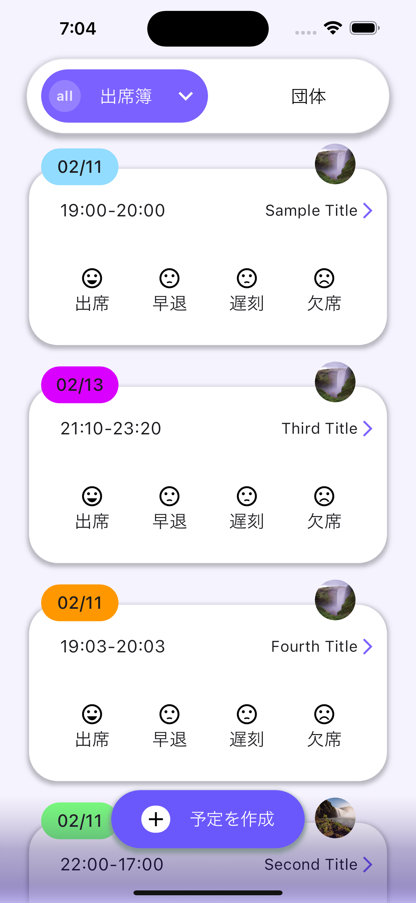
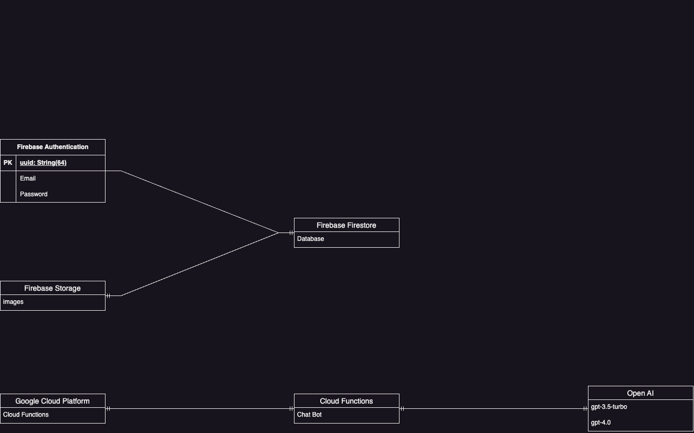

<p align="center">
  
</p>
<h1 align="center">Circle Logpose✨</h1>
<h3 align="center">Circle Management Application</h3>
<p align="center">
    　
    
</p>

<p align="center">
    <!-- 画面スクリーンショット何枚かここへ -->
    
    
    
</p>

## Overview
Circle Logpose is designed for managing club activities. It primarily features AI-powered chat functionality, attendance management, visualization of attendance rates through charts, user profile capabilities, and the ability to form small teams within the club.

## 概要
サークルの活動を管理するアプリです。主に、AIを用いたチャット機能、出席管理、出席率などをチャート化、ユーザーのプロフィール機能、サークル内での小規模チーム化などが可能です。

## Architecture
<p align="center">
    
</p>


## Features
- ✨ 新規登録/ログイン機能
- ✨ プロフィール機能
- ✨ グループ機能
- ✨ スケジュール機能

## Installation & Getting Started
- git clone後、pubspec.yaml📄が存在するパスで、flutter run　を実行すると起動できます。
- 詳しくは、Notionのドキュメントを参照して下さい。

## OSサポート
<table>
    <tr>
        <td></td>
        <td></td>
    </tr>
    <tr>
        <td>✅ Android</td>
        <td>✅ iOS</td>
    </tr>
</table>

## Contributing
- 詳しくは、Notionのドキュメントを参照して下さい。

## Contributors
<table>
  <tbody>
    <tr>
      <td align="center" valign="top" width="14.28%"><a href="https://github.com/YoungmanCH"><br />
      <sub><b>✨Tsubasa Youngman</b></sub></a><br />
        Engineer/PM
      </td>
      <td align="center" valign="top" width="14.28%"><a href="https://github.com/MORIMOTO520212"><br />
      <sub><b>Yuma Morimoto</b></sub></a><br />
        Advisor
      </td>
      <td align="center" valign="top" width="14.28%"><a href="https://github.com/char5742"><br />
      <sub><b>Mr.Fujino</b></sub></a><br />
        Advisor
      </td>
      <td align="center" valign="top" width="14.28%"><a href="https://github.com/ichiro16go"><br />
      <sub><b>Ichiro</b></sub></a><br />
        Engineer
      </td>
    </tr>
    <tr>
      <td align="center" valign="top" width="14.28%"><a href="https://github.com/inumaruseiya"><br />
      <sub><b>Inumaru</b></sub></a><br />
        Engineer
      </td>
      <td align="center" valign="top" width="14.28%"><a href="https://github.com/pentabi"><br />
      <sub><b>Tabito</b></sub></a><br />
        Engineer
      </td>
      <td align="center" valign="top" width="14.28%"><a href="https://github.com/tanakamoe20"><br />
      <sub><b>Moe</b></sub></a><br />
        Engineer
      </td>
      <td align="center" valign="top" width="14.28%"><a href="https://github.com/Rhnnt"><br />
      <sub><b>Rio</b></sub></a><br />
        Engineer
      </td>
    </tr>
    <tr>
      <td align="center" valign="top" width="14.28%"><a href="https://github.com/Hooli2111"><br />
      <sub><b>Kenta</b></sub></a><br />
        Engineer
      </td>
      <td align="center" valign="top" width="14.28%"><a href="https://github.com/koyama1024"><br />
      <sub><b>Yuki</b></sub></a><br />
        Engineer
      </td>
      <td align="center" valign="top" width="14.28%"><a href=""><br />
      <sub><b>Rikuya</b></sub></a><br />
        Engineer
      </td>
      <td align="center" valign="top" width="14.28%"><a href="https://github.com/shotaro1412"><br />
      <sub><b>Shotaro</b></sub></a><br />
        Engineer
      </td>
    </tr>
    <tr>
      <td align="center" valign="top" width="14.28%"><a href="https://github.com/yugo55"><br />
      <sub><b>Yugo</b></sub></a><br />
        Engineer
      </td>
      <td align="center" valign="top" width="14.28%"><a href=""><br />
      <sub><b>✨Hikari</b></sub></a><br />
        Designer/UX
      </td>
      <td align="center" valign="top" width="14.28%"><a href="https://github.com/chisatoimaeda"><br />
      <sub><b>Chisato</b></sub></a><br />
        Designer/UX
      </td>
    </tr>
  </tbody>
</table>
<p align="right">2024年2月11日更新</p>

## License
Reusing the design of the application without permission is prohibited.

## ライセンス
アプリ上のDesignを許可なく転用することを禁止します。

## Linter & Formatter
Used: pedantic_mono

## Composition of Files, Folders.
```
lib
├── firebase_options.dart
├── main.dart
├── routes
│   ├── app.dart
│   └── app_controller.dart
├── src
│   ├── common
│   │   ├── color_palette.dart
│   │   └── error_messages.dart
│   ├── controllers
│   │   ├── common
│   │   │   └── loading
│   │   │       └── loading_progress.dart
│   │   ├── providers
│   │   │   ├── email_provider.dart
│   │   │   ├── group
│   │   │   │   ├── admin
│   │   │   │   │   ├── group_admin_profile_list_provider.dart
│   │   │   │   │   └── group_admin_profile_provider.dart
│   │   │   │   ├── group
│   │   │   │   │   ├── group_and_id_modal_provider.dart
│   │   │   │   │   ├── group_profile_provider.dart
│   │   │   │   │   ├── group_setting_provider.dart
│   │   │   │   │   ├── set_group_name_and_member_data_provider.dart
│   │   │   │   │   └── watch_joined_group_exist_provider.dart
│   │   │   │   ├── member
│   │   │   │   │   ├── group_member_profile_list_provider.dart
│   │   │   │   │   └── set_group_member_list_provider.dart
│   │   │   │   ├── mode
│   │   │   │   │   ├── group_member_delete_mode_provider.dart
│   │   │   │   │   └── schedule_delete_mode_provider.dart
│   │   │   │   ├── msg
│   │   │   │   │   ├── group_name_error_msg_provider.dart
│   │   │   │   │   └── schedule_error_msg_provider.dart
│   │   │   │   ├── name
│   │   │   │   │   └── group_name_provider.dart
│   │   │   │   └── schedule
│   │   │   │       ├── group_member_schedule_provider.dart
│   │   │   │       ├── group_schedule_and_id_provider.dart
│   │   │   │       ├── group_schedule_provider.dart
│   │   │   │       ├── reaponsed_member_not_absence_schedule_list_provider.dart
│   │   │   │       ├── responsed_group_member_schedule_provider.dart
│   │   │   │       └── set_group_schedule_provider.dart
│   │   │   ├── password_provider.dart
│   │   │   ├── user
│   │   │   │   ├── set_search_user_data_provider.dart
│   │   │   │   └── user_profile_provider.dart
│   │   │   └── utils
│   │   │       ├── group_and_id_provider.dart
│   │   │       └── group_profile_schedule_id_provider.dart
│   │   ├── src
│   │   │   ├── group
│   │   │   │   ├── create
│   │   │   │   │   ├── create_group.dart
│   │   │   │   │   ├── create_group_invitation_link.dart
│   │   │   │   │   ├── create_group_schedule.dart
│   │   │   │   │   └── create_members_schedule.dart
│   │   │   │   ├── delete
│   │   │   │   │   └── delete_schedule.dart
│   │   │   │   └── update
│   │   │   │       ├── update_group_member_schedule_setting.dart
│   │   │   │       ├── update_group_schedule.dart
│   │   │   │       └── update_group_settings.dart
│   │   │   ├── login
│   │   │   │   └── login_controller.dart
│   │   │   ├── signup
│   │   │   │   └── signup_controller.dart
│   │   │   └── user
│   │   │       ├── update_account_id.dart
│   │   │       └── user_profile
│   │   │           └── update_user_profile.dart
│   │   └── validation
│   │       ├── email_validation.dart
│   │       ├── group
│   │       │   └── group_validation.dart
│   │       ├── password_validation.dart
│   │       ├── schedule_validation.dart
│   │       └── user
│   │           ├── account_id_validation.dart
│   │           └── user_validation.dart
│   ├── entities
│   │   └── device
│   │       └── image_controller.dart
│   ├── models
│   │   ├── auth
│   │   │   └── auth.dart
│   │   ├── group
│   │   │   ├── database
│   │   │   │   ├── group.dart
│   │   │   │   ├── group_membership.dart
│   │   │   │   ├── group_schedule.dart
│   │   │   │   ├── invitation.dart
│   │   │   │   └── member_schedule.dart
│   │   │   ├── group_and_id_model.dart
│   │   │   ├── group_profile_and_schedule_and_id_model.dart
│   │   │   └── group_schedule_and_id_model.dart
│   │   └── user
│   │       └── user.dart
│   ├── services
│   │   ├── auth
│   │   │   └── auth_controller.dart
│   │   ├── database
│   │   │   ├── group_controller.dart
│   │   │   ├── group_membership_controller.dart
│   │   │   ├── group_schedule_controller.dart
│   │   │   ├── invitation_controller.dart
│   │   │   ├── member_schedule_controller.dart
│   │   │   └── user_controller.dart
│   │   └── storage
│   │       └── storage.dart
│   ├── utils
│   │   ├── clipboard
│   │   │   └── copy_to_clipboard.dart
│   │   ├── color
│   │   │   └── color_exchanger.dart
│   │   ├── schedule
│   │   │   └── schedule_response.dart
│   │   └── time
│   │       └── time_utils.dart
│   └── views
│       ├── src
│       │   ├── group
│       │   │   ├── create
│       │   │   │   ├── components
│       │   │   │   │   ├── admin
│       │   │   │   │   │   └── group_admin.dart
│       │   │   │   │   ├── components
│       │   │   │   │   │   └── group_contents.dart
│       │   │   │   │   └── membership
│       │   │   │   │       └── group_member.dart
│       │   │   │   └── group_create_page.dart
│       │   │   └── setting
│       │   │       ├── components
│       │   │       │   ├── group_member_image.dart
│       │   │       │   └── schedule_component.dart
│       │   │       └── group_setting_page.dart
│       │   ├── home
│       │   │   ├── components
│       │   │   │   ├── attendance
│       │   │   │   │   ├── components
│       │   │   │   │   │   └── schedule_card.dart
│       │   │   │   │   └── schedule_list_viewer.dart
│       │   │   │   └── group
│       │   │   │       ├── components
│       │   │   │       │   └── group_box.dart
│       │   │   │       └── joined_group_list.dart
│       │   │   └── home_page.dart
│       │   ├── login
│       │   │   └── login_page.dart
│       │   ├── popup
│       │   │   ├── add_member
│       │   │   │   └── add_member.dart
│       │   │   ├── behind_and_early_setting
│       │   │   │   ├── behind_and_early_setting.dart
│       │   │   │   └── components
│       │   │   │       ├── join_time.dart
│       │   │   │       └── picker
│       │   │   │           ├── join_end_picker.dart
│       │   │   │           └── join_start_picker.dart
│       │   │   ├── group_filtering
│       │   │   │   ├── components
│       │   │   │   │   └── group_serect_button.dart
│       │   │   │   ├── group_filtering_controller.dart
│       │   │   │   └── group_filtering_popup.dart
│       │   │   ├── schedule_create
│       │   │   │   ├── components
│       │   │   │   │   ├── group_picker
│       │   │   │   │   │   ├── group_picker_button.dart
│       │   │   │   │   │   └── group_picker_modal.dart
│       │   │   │   │   ├── schedule_activity_time.dart
│       │   │   │   │   └── time_picker
│       │   │   │   │       ├── activity_end_at.dart
│       │   │   │   │       └── activity_start_at.dart
│       │   │   │   └── schedule_create.dart
│       │   │   ├── schedule_detail_confirm
│       │   │   │   ├── components
│       │   │   │   │   └── responsed_member.dart
│       │   │   │   └── schedule_detail_confirm.dart
│       │   │   ├── schedule_join_member
│       │   │   │   ├── components
│       │   │   │   │   └── join_member.dart
│       │   │   │   └── schedule_join_member.dart
│       │   │   └── schedule_setting
│       │   │       ├── update_activity_end_time.dart
│       │   │       ├── update_activity_start_time_picker.dart
│       │   │       ├── update_activity_time.dart
│       │   │       └── update_schedule.dart
│       │   ├── signup
│       │   │   └── signup_page.dart
│       │   ├── start
│       │   │   └── start_page.dart
│       │   └── user
│       │       ├── account_id
│       │       │   └── account_id_setting.dart
│       │       ├── components
│       │       │   └── joined_group.dart
│       │       ├── email
│       │       │   └── email_setting.dart
│       │       ├── password
│       │       │   └── password_setting.dart
│       │       └── user_setting_page.dart
│       └── widgets
│           ├── progress
│           │   └── progress_indicator.dart
│           └── slide
│               ├── slide_segmented_tab_control.dart
│               ├── src
│               │   ├── slide_tab.dart
│               │   ├── slide_tab_bar.dart
│               │   ├── slide_tab_controller.dart
│               │   ├── tab_component.dart
│               │   └── utils
│               │       ├── clippers.dart
│               │       └── range.dart
│               └── tabs
│                   ├── attendance_tab.dart
│                   ├── group_create_tab.dart
│                   └── user_setting_tab.dart
├── test
│   ├── test.dart
│   └── test.py
└── validation
    ├── email_validation.dart
    ├── max_length_validation.dart
    ├── min_length_validation.dart
    ├── required_validation.dart
    └── validation.dart

94 directories, 134 files
