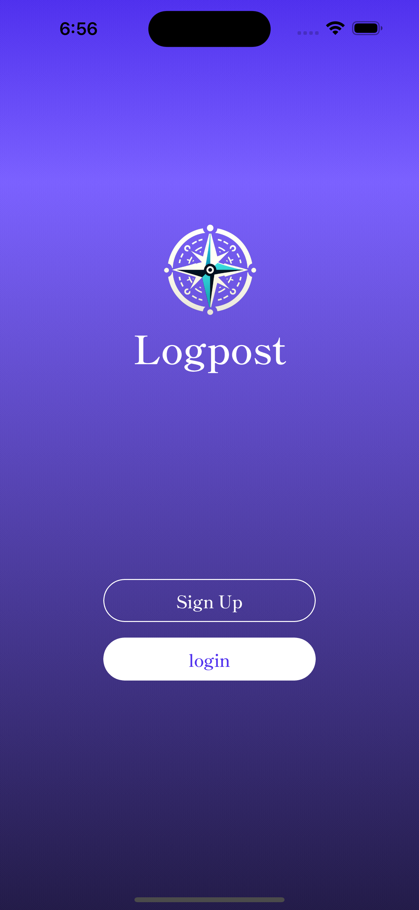
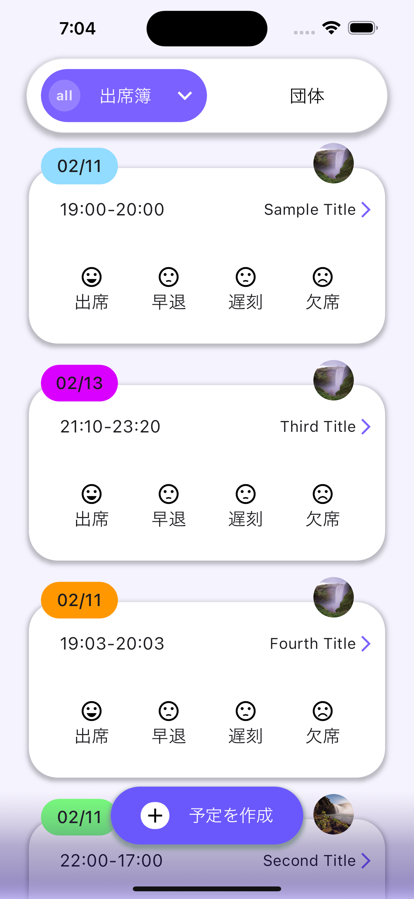
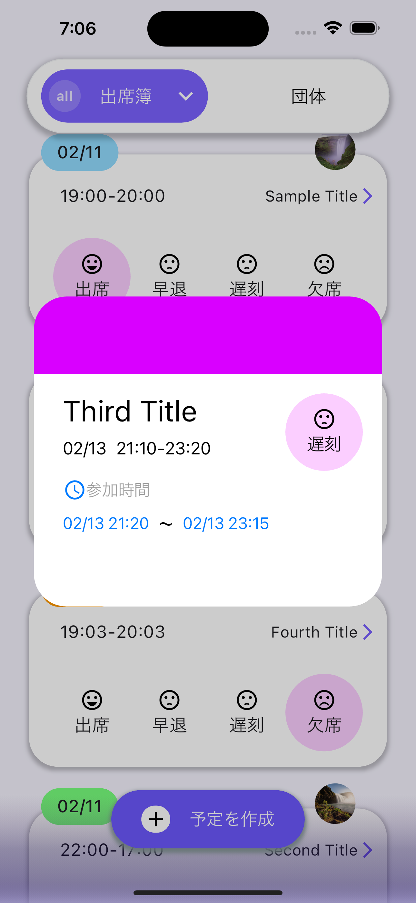

<p align="center">
  
</p>
<h1 align="center">Circle Logpost✨</h1>
<h3 align="center">Circle Management Application</h3>
<p align="center">
    　
    
</p>

<p align="center">
    <!-- 画面スクリーンショット何枚かここへ -->
    
    
    
</p>

## Overview
Circle Logpost is designed for managing club activities. It primarily features AI-powered chat functionality, attendance management, visualization of attendance rates through charts, user profile capabilities, and the ability to form small teams within the club.

## 概要
サークルの活動を管理するアプリです。主に、AIを用いたチャット機能、出席管理、出席率などをチャート化、ユーザーのプロフィール機能、サークル内での小規模チーム化などが可能です。

## Architecture
<p align="center">
    
</p>


## Features
- ✨ 新規登録/ログイン機能
- ✨ プロフィール機能
- ✨ グループ機能
- ✨ スケジュール機能

## Installation & Getting Started
- git clone後、pubspec.yaml📄が存在するパスで、flutter run　を実行すると起動できます。
- 詳しくは、Notionのドキュメントを参照して下さい。

## OSサポート
<table>
    <tr>
        <td></td>
        <td></td>
    </tr>
    <tr>
        <td>✅ Android</td>
        <td>✅ iOS</td>
    </tr>
</table>

## Contributing
- 詳しくは、Notionのドキュメントを参照して下さい。

## Contributors
<table>
  <tbody>
    <tr>
      <td align="center" valign="top" width="14.28%"><a href="https://github.com/YoungmanCH"><br />
      <sub><b>✨Tsubasa Youngman</b></sub></a><br />
        Engineer/PM
      </td>
      <td align="center" valign="top" width="14.28%"><a href="https://github.com/MORIMOTO520212"><br />
      <sub><b>Yuma Morimoto</b></sub></a><br />
        Advisor
      </td>
      <td align="center" valign="top" width="14.28%"><a href="https://github.com/char5742"><br />
      <sub><b>Mr.Fujino</b></sub></a><br />
        Advisor
      </td>
      <td align="center" valign="top" width="14.28%"><a href="https://github.com/ichiro16go"><br />
      <sub><b>Ichiro</b></sub></a><br />
        Engineer
      </td>
    </tr>
    <tr>
      <td align="center" valign="top" width="14.28%"><a href="https://github.com/inumaruseiya"><br />
      <sub><b>Inumaru</b></sub></a><br />
        Engineer
      </td>
      <td align="center" valign="top" width="14.28%"><a href="https://github.com/pentabi"><br />
      <sub><b>Tabito</b></sub></a><br />
        Engineer
      </td>
      <td align="center" valign="top" width="14.28%"><a href="https://github.com/tanakamoe20"><br />
      <sub><b>Moe</b></sub></a><br />
        Engineer
      </td>
      <td align="center" valign="top" width="14.28%"><a href="https://github.com/Rhnnt"><br />
      <sub><b>Rio</b></sub></a><br />
        Engineer
      </td>
    </tr>
    <tr>
      <td align="center" valign="top" width="14.28%"><a href="https://github.com/Hooli2111"><br />
      <sub><b>Kenta</b></sub></a><br />
        Engineer
      </td>
      <td align="center" valign="top" width="14.28%"><a href="https://github.com/koyama1024"><br />
      <sub><b>Yuki</b></sub></a><br />
        Engineer
      </td>
      <td align="center" valign="top" width="14.28%"><a href=""><br />
      <sub><b>Rikuya</b></sub></a><br />
        Engineer
      </td>
      <td align="center" valign="top" width="14.28%"><a href="https://github.com/shotaro1412"><br />
      <sub><b>Shotaro</b></sub></a><br />
        Engineer
      </td>
    </tr>
    <tr>
      <td align="center" valign="top" width="14.28%"><a href="https://github.com/yugo55"><br />
      <sub><b>Yugo</b></sub></a><br />
        Engineer
      </td>
      <td align="center" valign="top" width="14.28%"><a href=""><br />
      <sub><b>✨Hikari</b></sub></a><br />
        Designer/UX
      </td>
      <td align="center" valign="top" width="14.28%"><a href="https://github.com/chisatoimaeda"><br />
      <sub><b>Chisato</b></sub></a><br />
        Designer/UX
      </td>
    </tr>
  </tbody>
</table>
<p align="right">2024年2月11日更新</p>

## License
Reusing the design of the application without permission is prohibited.

## ライセンス
アプリ上のDesignを許可なく転用することを禁止します。

## Linter & Formatter
Used: pedantic_mono

## Composition of Files, Folders.
```
lib
├── app
│   ├── app.dart
│   └── app_controller.dart
├── controller
│   ├── common
│   │   ├── color_exchanger.dart
│   │   ├── copy_to_clipboard.dart
│   │   └── time_controller.dart
│   └── entities
│       └── device
│           └── image_controller.dart
├── database
│   ├── auth
│   │   ├── auth.dart
│   │   └── auth_controller.dart
│   ├── common
│   │   └── error_messages.dart
│   ├── group
│   │   ├── group
│   │   │   ├── group.dart
│   │   │   └── group_controller.dart
│   │   ├── invitation
│   │   │   ├── invitation.dart
│   │   │   └── invitation_controller.dart
│   │   ├── membership
│   │   │   ├── group_membership.dart
│   │   │   └── group_membership_controller.dart
│   │   └── schedule
│   │       ├── member_schedule
│   │       │   ├── member_schedule.dart
│   │       │   └── member_schedule_controller.dart
│   │       └── schedule
│   │           ├── schedule.dart
│   │           └── schedule_controller.dart
│   └── user
│       ├── user.dart
│       └── user_controller.dart
├── firebase_options.dart
├── main.dart
├── pages
│   ├── common
│   │   ├── slide
│   │   │   ├── slide_segmented_tab_control.dart
│   │   │   ├── src
│   │   │   │   ├── slide_tab.dart
│   │   │   │   ├── slide_tab_bar.dart
│   │   │   │   ├── slide_tab_controller.dart
│   │   │   │   ├── tab_component.dart
│   │   │   │   └── utils
│   │   │   │       ├── clippers.dart
│   │   │   │       └── range.dart
│   │   │   └── tabs
│   │   │       ├── attendance_tab.dart
│   │   │       ├── group_create_tab.dart
│   │   │       └── user_setting_tab.dart
│   │   └── src
│   │       └── color
│   │           └── color_palette.dart
│   └── src
│       ├── account
│       │   ├── account_setting_controller.dart
│       │   ├── account_setting_page.dart
│       │   └── parts
│       │       ├── email
│       │       │   ├── email_setting.dart
│       │       │   ├── email_setting_controller.dart
│       │       │   └── email_verification.dart
│       │       ├── group
│       │       │   └── joined_group.dart
│       │       ├── id
│       │       │   ├── id_setting.dart
│       │       │   └── id_setting_controller.dart
│       │       └── password
│       │           ├── password_setting.dart
│       │           └── password_setting_controller.dart
│       ├── group
│       │   ├── create
│       │   │   ├── group_create_controller.dart
│       │   │   ├── group_create_page.dart
│       │   │   └── parts
│       │   │       ├── admin
│       │   │       │   └── group_admin.dart
│       │   │       ├── components
│       │   │       │   ├── group_contents.dart
│       │   │       │   └── group_contents_controller.dart
│       │   │       ├── membership
│       │   │       │   ├── group_member.dart
│       │   │       │   └── group_member_controller.dart
│       │   │       └── progress_indicator
│       │   │           └── group_create_progress_indicator.dart
│       │   └── setting
│       │       ├── group_setting_controller.dart
│       │       ├── group_setting_page.dart
│       │       └── parts
│       │           ├── group_member_image.dart
│       │           ├── schedule_card.dart
│       │           └── schedule_card_controller.dart
│       ├── home
│       │   ├── home_controller.dart
│       │   ├── home_page.dart
│       │   └── parts
│       │       ├── attendance
│       │       │   ├── join_time.dart
│       │       │   ├── join_time_picker.dart
│       │       │   ├── schedule_box.dart
│       │       │   ├── schedule_box_controller.dart
│       │       │   ├── schedule_response.dart
│       │       │   ├── user_schedule_controller.dart
│       │       │   └── user_schedules.dart
│       │       └── group
│       │           ├── controller
│       │           │   ├── group_box_controller.dart
│       │           │   └── joined_group_controller.dart
│       │           ├── group_box.dart
│       │           └── joined_groups.dart
│       ├── login
│       │   ├── login_controller.dart
│       │   ├── login_page.dart
│       │   └── parts
│       │       └── progress_indicator.dart
│       ├── popup
│       │   ├── behind_and_early_setting
│       │   │   ├── behind_and_early_setting.dart
│       │   │   └── behind_and_early_setting_controller.dart
│       │   ├── group_filtering
│       │   │   ├── group_filtering_controller.dart
│       │   │   ├── group_filtering_popup.dart
│       │   │   └── part
│       │   │       └── group_serect_button.dart
│       │   ├── member_add
│       │   │   ├── member_add.dart
│       │   │   └── member_add_controller.dart
│       │   ├── schedule_create
│       │   │   ├── parts
│       │   │   │   ├── activity_time.dart
│       │   │   │   ├── group_picker
│       │   │   │   │   ├── button.dart
│       │   │   │   │   └── modal.dart
│       │   │   │   └── time_picker.dart
│       │   │   ├── schedule_create.dart
│       │   │   └── schedule_create_controller.dart
│       │   ├── schedule_detail_confirm
│       │   │   ├── parts
│       │   │   │   ├── reaponsed_member_controller.dart
│       │   │   │   └── responsed_member.dart
│       │   │   ├── schedule_detail_confirm.dart
│       │   │   └── schedule_detail_confirm_controller.dart
│       │   ├── schedule_join_member
│       │   │   ├── parts
│       │   │   │   └── join_member.dart
│       │   │   ├── schedule_join_member.dart
│       │   │   └── schedule_join_member_controller.dart
│       │   └── schedule_setting
│       │       ├── change_activity_time.dart
│       │       ├── change_activity_time_picker.dart
│       │       ├── schedule_change.dart
│       │       └── schedule_change_controller.dart
│       ├── signup
│       │   ├── parts
│       │   │   └── progress_indicator.dart
│       │   ├── signup_controller.dart
│       │   └── signup_page.dart
│       └── start
│           ├── start_controller.dart
│           └── start_page.dart
├── storage
│   └── storage.dart
├── test
│   ├── test.dart
│   └── test.py
└── validation
    └── validation.dart

67 directories, 106 files
```
