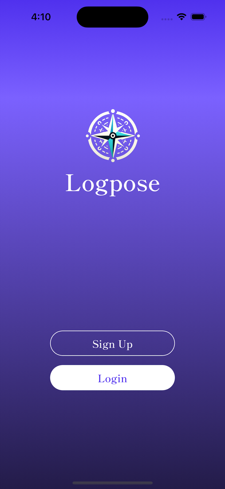
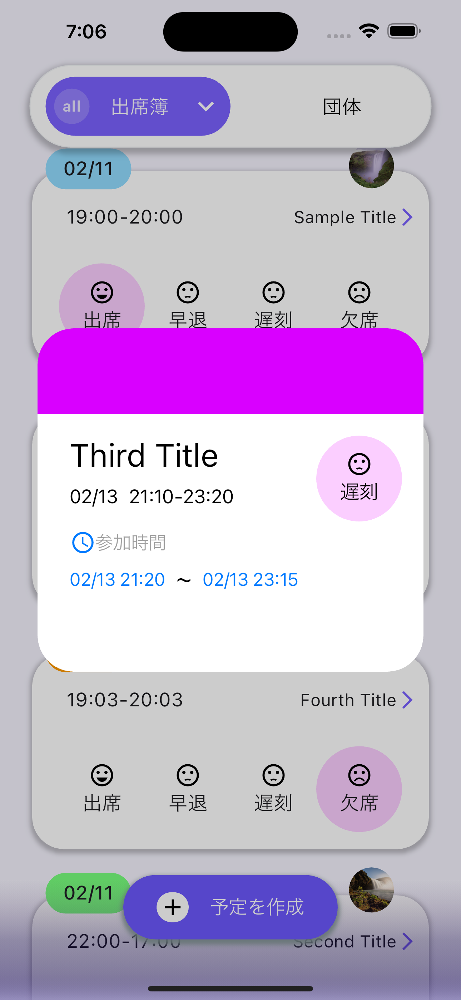

<h1 align="center">Logpose</h1>

  
  <h3 align="center">Circle/Team Management Application</h3>

  　
  

  
  
  

Logpose is designed for managing club activities. It primarily features AI-powered chat functionality, attendance management, visualization of attendance rates through charts, user profile capabilities, and the ability to form small teams within the club.

## Install link：　

<a href="https://itunes.apple.com/WebObjects/MZStore.woa/wa/viewSoftware?id=6502499242">Logpose</a>

Welcome to Logpose! Please select your preferred language.

## Languages / 言語

- [English](./README_en.md)
- [日本語](./README_ja.md)
  
   